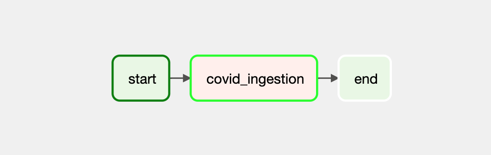

# Running the Covid Dataset Pipeline
The project has been tested with
 
```sh
Docker version 19.03.13, build 4484c46d9d
docker-compose version 1.27.4, build 40524192
```
After cloning the repository, make sure to setup the following environment variables and don't push them to git. `.env` in this repository is just a sample
```diff
- DATASET_POSTGRES_DB=dev
- POSTGRES_USER=dev
- POSTGRES_PASSWORD=kP/]^hGb}_F:`>a_GE(H>Zb+LJ^/t;aQcQU86d$\*2
+ DATASET_POSTGRES_DB=<your-db>
+ POSTGRES_USER=<your-user>
+ POSTGRES_PASSWORD=<your-password>
```
In the project root run the following command to initialize airflow and create a default user
```sh
docker-compose up airflow-init
```
Now, for Airflow UI, username:password will be `airflow:airflow`

Now run the following command to initialize all containers. `--build` flag makes sure the containers are built before launch. This flag is default for the first run. 
```sh
docker-compose up --build
```
The airflow UI can be accessed on `http://localhost:8080`

# Architecture
## Tweaks in Airflow config
By default `AIRFLOW__CORE__LOAD_EXAMPLES` is true, I've set it to false so that we can see only our dags.
`POSTGRES_USER`, `POSTGRES_PASSWORD` are coming from the `.env`
```yaml
AIRFLOW__CORE__LOAD_EXAMPLES: 'false'
POSTGRES_USER: ${POSTGRES_USER}
POSTGRES_PASSWORD: ${POSTGRES_PASSWORD}
```
Our own instance of database has been added under the `services` section at the end of `docker-compose.yml` file along with a volume
```yaml
db:
	image: postgres:14.2-alpine
	restart: always
	volumes:
		- postgres_data:/var/lib/postgresql/data/
	env_file:
		- ./.env
	ports:
		- 5432:5432

volumes:
	postgres_data:
```
## Database Schema
We have 3 main tables
- tbl_covid_records
	```sql
		CREATE TABLE IF NOT EXISTS tbl_covid_records (
		record_id SERIAL PRIMARY KEY,
		fips INTEGER,
		admin2 VARCHAR(255),
		province_state_id INTEGER,
		country_region_id INTEGER,
		last_update TIMESTAMP,
		latitude DECIMAL,
		longitude DECIMAL,
		confirmed INTEGER,
		deaths INTEGER,
		recovered INTEGER,
		active INTEGER,
		combined_key VARCHAR(255),
		incident_rate DECIMAL,
		case_fatality_ratio DECIMAL,
		CONSTRAINT fk_province_state FOREIGN KEY (province_state_id) REFERENCES lu_province_state(province_state_id),
		CONSTRAINT fk_country_region FOREIGN KEY (country_region_id) REFERENCES lu_country_region(country_region_id)
	);
	```
- lu_province_state with `unique constraint`
	```sql
	CREATE TABLE IF NOT EXISTS lu_province_state (
		province_state_id SERIAL PRIMARY KEY,
		province_state VARCHAR(255),
		CONSTRAINT unq_province_state UNIQUE (province_state)
	);
	```
- lu_country_region with `unique constraint`
	```sql
	CREATE TABLE IF NOT EXISTS lu_country_region (
		country_region_id SERIAL PRIMARY KEY,
		country_region VARCHAR(255),
		CONSTRAINT unq_country_region UNIQUE (country_region)
	);
	```
## Upserts for lookup tables
For the first run of ingestion, these tables would be entry so for each record there can be duplicates. e.g.
```sql
INSERT INTO lu_province_state (province_state)
VALUES (%s) ON CONFLICT ON CONSTRAINT unq_province_state
DO UPDATE SET province_state = EXCLUDED.province_state RETURNING province_state_id;
```

## Field mappings
The keys of the field mapping dictionary corresponds to the `tbl_covid_records` column names. This is useful if we have to perform special operations for relational fields. The `keys` property of an item is used to lookup field in the dataset row. If a key yields a value, rest of the keys will be ignored.

`normalizer` is function that is used to convert the raw value according to the schema.
```json
FIELD_MAPPING = {
    "fips": {'keys': ['FIPS',], 'normalizer': lambda x: int(float(x))},
    "admin2": {'keys': ['Admin2',], 'normalizer': str},
    "province_state": {'keys': ['Province_State', 'Province/State',], 'normalizer': str},
    "country_region": {'keys': ['Country_Region', 'Country/Region',], 'normalizer': str},
    "last_update": {'keys': ['Last_Update', 'Last Update'], 'normalizer': str}
	...
}
```

Seen keys are used to detect if a different set of columns have been received in the dataset. If a different set appears, that dataset will be ignored and will be logged.

```json
SEEN_KEYS = [
    'FIPS',
    'Admin2',

    'Province_State',
    'Province/State',

    'Country_Region',
    'Country/Region',

    'Last_Update',
    'Last Update',

    'Latitude',
    'Lat',
	...
]
```

## Improvements
1. We can discard the use of `SEEN_KEYS` by picking up dataset columns based on index. So if a dataset has different number of columns, ideally, the ingestion should fail.
2. We can use a clever `regular expression` or `string matching algorithm` to normalize columns
3. DAG tasks can be divided into granular subtasks. E.g. fetching tables foreign key constraint tables.